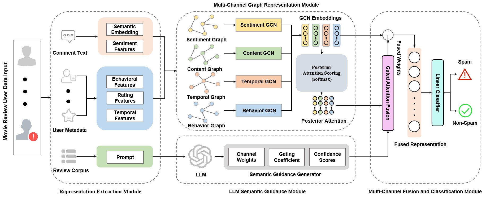

# MGLS: Malicious User Detection on Movie Review Platforms with Multi-Channel Graphs and LLM-assisted Semantic Guidance

Official repository for the IJCNN paper:

**"MGLS: Malicious User Detection on Movie Review Platforms with Multi-Channel Graphs and LLM-assisted Semantic Guidance"**

Authors: `<Jianwei Xu>, <Haizhou Wang>`

## News

- [2026.03] Official repository released.

## Overview

MGLS is a malicious user detection framework for movie review platforms. We construct a user-level malicious user dataset, **DMU-Dataset**, and propose a multi-channel graph model with LLM-assisted semantic guidance for robust detection.

## Methodology

MGLS contains four main components:

- **Representation Extraction**: We build user representations from review semantics, sentiment intensity, off-topic probability, and behavioral features.
- **Multi-Channel Graph Modeling**: We construct user relation graphs from four perspectives: sentiment, content, temporal patterns, and behavior.
- **LLM-assisted Semantic Guidance**: We use an LLM to generate semantic channel weights from movie-level information.
- **Fusion and Classification**: We combine graph-learned and LLM-guided signals for final malicious user classification.

## Dataset

We construct **DMU-Dataset (Douban Movie Malicious User Dataset)** based on the Douban movie platform.

- 434 movies
- 14,795 users
- 59,161 review records

## Results

MGLS achieves strong performance on DMU-Dataset:

- Accuracy: **90.27%**
- F1-score: **87.16%**

## Acknowledgement

We thank the open-source projects and prior research that supported this work.

## License

The license of the code can be found in `LICENSE.md`.

## Contact

If you have any questions, please contact:

- `<Jianwei Xu>`
- `<2022141410250@stu.scu.edu.cn>`
